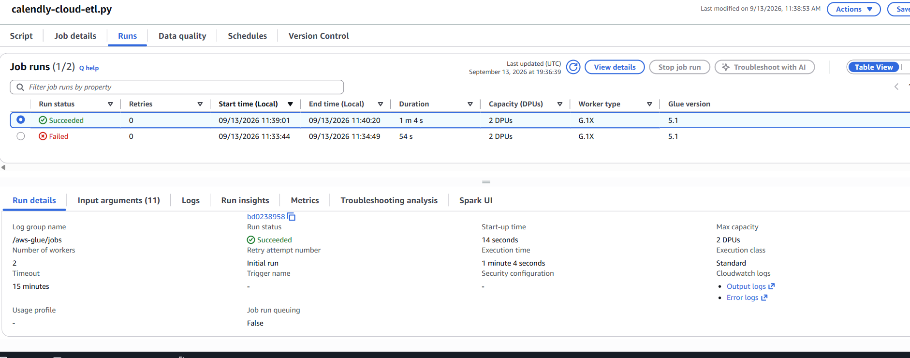
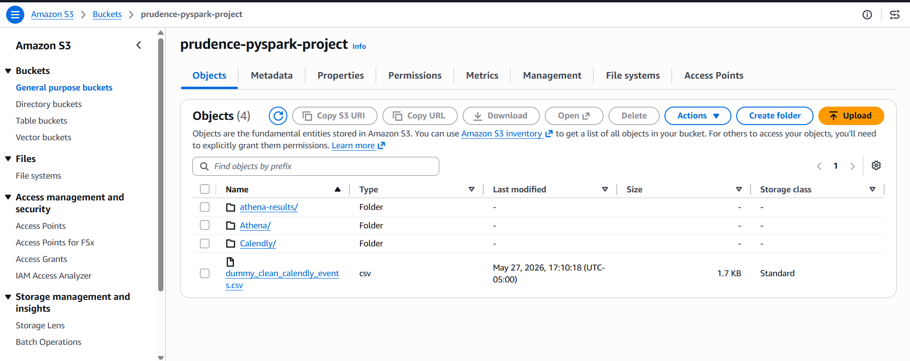
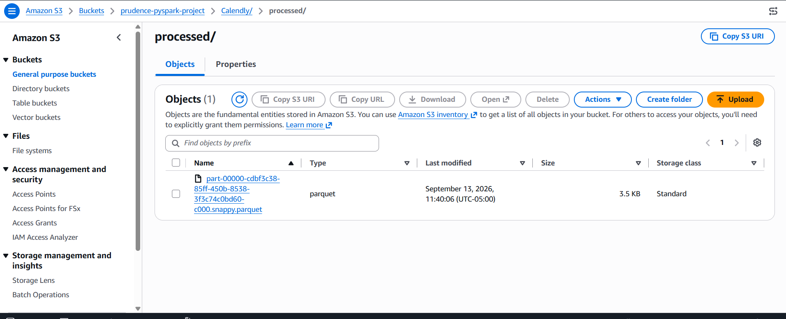
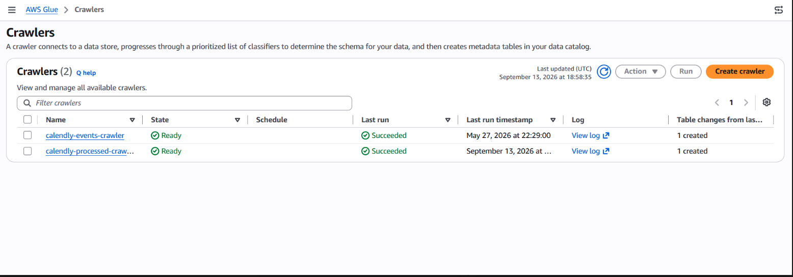
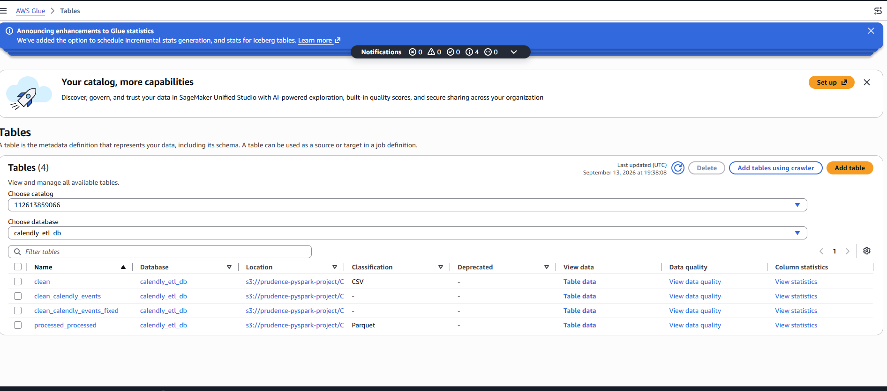
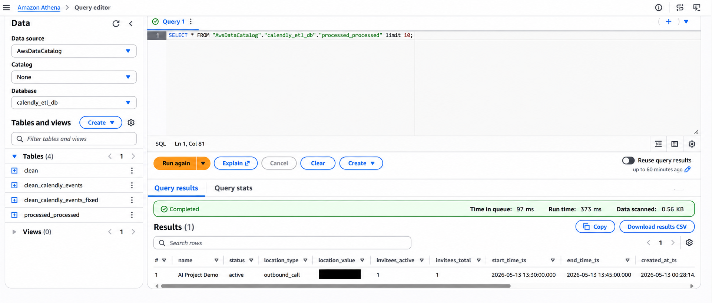

# Calendly PySpark AWS ETL Pipeline

## Project Overview

This project is an end-to-end data engineering pipeline that extracts Calendly event data, transforms and validates it using Python and PySpark, orchestrates local ETL tasks with Apache Airflow, and extends the pipeline into AWS for cloud-based processing and analytics.

The project began as a local ETL pipeline and was expanded into a cloud data workflow using Amazon S3, AWS Glue, the AWS Glue Data Catalog, and Amazon Athena.

The completed pipeline demonstrates API integration, ETL development, workflow orchestration, distributed data processing, cloud storage, schema management, serverless analytics, and troubleshooting.

---

## Architecture

```text
Calendly API
     ↓
Python Extraction
     ↓
PySpark Transformation
     ↓
Local Airflow Orchestration
     ↓
Amazon S3 — Clean Layer
     ↓
AWS Glue PySpark ETL
     ↓
Amazon S3 — Processed Parquet Layer
     ↓
AWS Glue Crawler
     ↓
AWS Glue Data Catalog
     ↓
Amazon Athena
     ↓
SQL Validation & Analytics
```

---

## Tech Stack

- Python
- PySpark
- Pandas
- Apache Airflow
- Calendly REST API
- Amazon S3
- AWS Glue
- AWS Glue Crawler
- AWS Glue Data Catalog
- Amazon Athena
- AWS IAM
- Parquet
- SQL
- boto3
- AWS CLI
- Git and GitHub

---

## Pipeline Workflow

### 1. Calendly API Extraction

Python connects to the Calendly API and retrieves scheduled event data.

The pipeline extracts information such as:

- Event name
- Event status
- Start and end times
- Location type and value
- Active and total invitees
- Event creation time
- Event URI

Sensitive API credentials are stored in environment variables and are not committed to GitHub.

### 2. Local Data Transformation

The Calendly API response is cleaned and transformed into a structured dataset using Python and PySpark.

The transformation process prepares the data for downstream cloud storage and analytics.

### 3. Apache Airflow Orchestration

The local workflow is orchestrated using Apache Airflow.

The DAG is located at:

`dags/calendly_etl_dag.py`

The workflow includes four primary tasks:

1. `fetch_calendly_events`
2. `transform_with_pyspark`
3. `validate_clean_file`
4. `upload_clean_to_s3`

This stage automates the local extraction, transformation, validation, and S3 upload process.

---

## Amazon S3 Data Lake

Amazon S3 is used as the cloud storage layer for the pipeline.

The project separates data by processing stage:

```text
Calendly/
├── clean/
└── processed/
```

The clean layer contains the cleaned CSV data produced by the local pipeline.

The processed layer contains analytics-ready Parquet data produced by AWS Glue.

---

## AWS Glue Cloud ETL

The project was extended from local processing into AWS using an AWS Glue PySpark ETL job.

The Glue job reads the cleaned Calendly dataset from:

```text
s3://prudence-pyspark-project/Calendly/clean/
```

The cloud transformation performs schema and datatype transformations, including timestamp conversion.

The processed dataset is written to:

```text
s3://prudence-pyspark-project/Calendly/processed/
```

AWS Glue writes the final dataset in Parquet format.

---

## Why Parquet?

Parquet is used for the processed data layer because it is a columnar format designed for analytical workloads.

Benefits include:

- Preservation of data types
- Efficient column-based querying
- Reduced data scanning
- Compatibility with Apache Spark
- Compatibility with Amazon Athena
- Better suitability for analytics than plain CSV

---

## AWS Glue Crawler and Data Catalog

An AWS Glue Crawler scans the processed Parquet data stored in Amazon S3.

The crawler identifies the schema and registers the dataset in the AWS Glue Data Catalog.

For this project, the crawler successfully created the processed table in:

`calendly_etl_db`

The generated table used for final validation was:

`processed_processed`

The Data Catalog makes the processed dataset discoverable by Amazon Athena without manually defining every field.

---

## Amazon Athena Validation

Amazon Athena was used to validate the completed cloud pipeline.

Example validation query:

```sql
SELECT *
FROM "AwsDataCatalog"."calendly_etl_db"."processed_processed"
LIMIT 10;
```

The query completed successfully and returned the transformed Calendly event record.

For the test dataset, Athena scanned approximately **0.56 KB** of data.

This validated the cloud workflow:

```text
S3 → AWS Glue → Parquet → Glue Crawler → Data Catalog → Athena
```

---

## Troubleshooting & Lessons Learned

### Calendly API Request Configuration

During development, the Calendly scheduled-events request required the authenticated user's URI.

The pipeline retrieves the authenticated user and uses the appropriate URI when requesting scheduled events.

### Local PySpark Environment

Local PySpark development required a compatible Python and Java environment.

The project uses a Python 3.11 virtual environment and Java configuration to support local Spark processing.

### Athena CSV Schema Mismatch

During the earlier Athena implementation, a schema mismatch occurred between the CSV data and the external table definition.

The issue was corrected by validating the source column order and recreating the table with the appropriate schema.

### AWS Glue Unresolved Column Error

The first AWS Glue cloud ETL execution failed with an unresolved-column error.

The transformation referenced:

`start_time_ts`

while the source CSV contained:

`start_time`

The Glue error output was used to identify the actual source schema.

The transformation was corrected to read `start_time` and generate the transformed `start_time_ts` column.

After correcting the schema mapping, the AWS Glue job completed successfully and generated the processed Parquet dataset.

This reinforced the importance of validating schemas between ETL stages rather than assuming that upstream and downstream column names are identical.

---

## Project Validation

The completed project successfully demonstrates:

- Calendly API data extraction
- Python data processing
- PySpark transformations
- Local Apache Airflow orchestration
- Amazon S3 cloud storage
- AWS Glue serverless PySpark ETL
- Parquet data generation
- AWS Glue Crawler schema discovery
- Glue Data Catalog integration
- Amazon Athena SQL querying
- Schema troubleshooting
- IAM-based AWS service access

---

## Screenshots

The following screenshots document key milestones from the cloud implementation.

### 1. AWS Glue ETL Job Success



AWS Glue successfully executed the PySpark ETL job after the source schema mapping was corrected. The run history also documents the earlier failed attempt and subsequent successful execution.

### 2. Amazon S3 Bucket Structure



Amazon S3 provides the cloud storage layer for the pipeline, separating Calendly data and Athena query results.

### 3. S3 Processed Parquet Output



AWS Glue transformed the cleaned Calendly dataset and wrote the analytics-ready output to the `Calendly/processed/` layer in compressed Parquet format.

### 4. AWS Glue Crawler Success



The AWS Glue crawler successfully scanned the processed Parquet dataset and created metadata for the Data Catalog.

### 5. AWS Glue Data Catalog



The processed Parquet dataset was registered in the `calendly_etl_db` database, making it available to downstream analytics services.

### 6. Amazon Athena Query Success



Amazon Athena successfully queried the processed dataset through the AWS Glue Data Catalog, validating the end-to-end cloud ETL pipeline. The test query completed in 373 ms and scanned 0.56 KB of data.

## Repository Structure
calendly-pyspark-aws-project/
│
├── README.md
├── requirements.txt
├── .gitignore
│
├── dags/
│   └── calendly_etl_dag.py
│
├── src/
│   └── Python/PySpark pipeline scripts
│
├── sql/
│   └── Athena SQL queries
│
└── docs/
    └── screenshots/
        ├── 01-glue-job-success.png
        ├── 02-s3-bucket-structure.png
        ├── 03-s3-parquet-output.png
        ├── 04-glue-crawler-success.png
        ├── 05-glue-data-catalog.png
        └── 06-athena-query-success.png


---

## Security

Sensitive credentials and local runtime files are excluded from version control.

The `.gitignore` excludes items such as:

- `.env`
- API tokens
- Virtual environments
- Airflow databases
- Airflow logs
- Local authentication files
- Generated data files
- macOS system files

AWS credentials and Calendly API tokens should never be committed to the repository.

AWS Glue accesses S3 through an IAM service role rather than credentials embedded in the ETL script.

---

## Skills Demonstrated

This project demonstrates hands-on experience with:

- Data Engineering
- ETL Pipeline Development
- REST API Integration
- Python
- Pandas
- PySpark
- Apache Airflow
- Distributed Data Processing
- Amazon S3
- AWS Glue
- AWS IAM
- AWS Glue Data Catalog
- Amazon Athena
- SQL
- Parquet
- Schema Management
- Cloud Troubleshooting
- Data Validation
- Git/GitHub

---

## Future Enhancements

Potential future enhancements include:

- Fully cloud-based workflow orchestration
- AWS EventBridge scheduling
- AWS Step Functions
- Amazon MWAA for managed Airflow
- AWS Secrets Manager for API credentials
- Automated data quality checks
- CloudWatch monitoring and alerting
- S3 partitioning for larger datasets
- Infrastructure as Code
- CI/CD automation
- Power BI or Tableau visualization

---

## Key Takeaway

This project demonstrates the evolution of a locally developed ETL pipeline into a cloud-based data engineering workflow.

Rather than using AWS services independently, the project connects API extraction, PySpark transformation, Airflow orchestration, cloud storage, serverless ETL processing, metadata management, Parquet storage, and SQL analytics into an end-to-end pipeline.